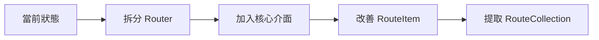

# 🎯 架構改進進度追蹤

## 更新日期
2025-12-21

## 總覽

本文件追蹤 [ARCHITECTURE_SUGGESTIONS.md](./ARCHITECTURE_SUGGESTIONS.md) 中建議項目的實作進度。

---

## ✅ 已完成項目

### 1. Request/Response 物件導向封裝

**優先級**: 🟡 中優先級 #4
**完成日期**: 2025-12-21
**對應 Phase**: Phase 3

#### 實作內容

- ✅ `src/Http/Request.php` - HTTP 請求封裝
  - 支援 URI、HTTP 方法、query、POST、headers、files
  - 便捷方法：`isAjax()`、`isJson()`、`isGet()`、`isPost()`
  - 自訂屬性系統用於路由參數
  - 靜態工廠方法：`capture()` 從全域變數建立

- ✅ `src/Http/Response.php` - HTTP 回應封裝
  - 支援內容、狀態碼、headers 管理
  - 工廠方法：`json()`、`redirect()`、`html()`、`text()`、`notFound()`、`error()`
  - 不可變方法：`withHeader()` 用於中介軟體鏈
  - 狀態檢查：`isSuccessful()`、`isError()`、`isNotFound()`

- ✅ Router 整合
  - 支援新舊兩種 dispatch 簽名
  - 自動轉換各種返回類型為 Response
  - 完全向後相容

#### 測試覆蓋

```
Request:   24 tests,  52 assertions
Response:  33 tests,  88 assertions
Router:    12 tests,  31 assertions
────────────────────────────────────
總計:      69 tests, 171 assertions
```

#### 收益

- ✅ 型別安全的請求回應處理
- ✅ 統一的 API 介面
- ✅ 更好的可測試性
- ✅ 100% 向後相容

---

### 2. 策略模式路由匹配器

**優先級**: 🔴 最高優先級 #3
**完成日期**: 2025-12-21
**對應 Phase**: Phase 2（部分）

#### 實作內容

- ✅ `src/Contracts/RouteMatcherInterface.php` - 匹配器介面
  ```php
  interface RouteMatcherInterface {
      public function match(RouteItem $route, string $uri): bool;
      public function extractParameters(RouteItem $route, string $uri): array;
  }
  ```

- ✅ `src/Matching/RegexMatcher.php` - 正則表達式匹配器
  - 支援必填參數：`{id}`
  - 支援選填參數：`{id?}`
  - 支援多個參數：`{category}/{id}`
  - 自動提取路由參數

- ✅ Router 依賴注入整合
  - Constructor 注入：`new Router($matcher)`
  - Setter 注入：`$router->setMatcher($matcher)`
  - Getter 方法：`$router->getMatcher()`
  - 預設使用 RegexMatcher

#### 測試覆蓋

```
RegexMatcher:         16 tests,  40 assertions
Router 策略整合:       8 tests,  12 assertions
──────────────────────────────────────────────
總計:                 24 tests,  52 assertions
```

#### 收益

- ✅ 符合開放封閉原則（OCP）
- ✅ 可替換匹配策略
- ✅ 易於擴展新的匹配器（如 ExactMatcher、TrieMatcher）
- ✅ 更好的單元測試能力

---

### 3. 洋蔥模式中介軟體管道

**優先級**: 🟡 中優先級 #5
**完成日期**: 2025-12-21
**對應 Phase**: Phase 4

#### 實作內容

- ✅ `src/Contracts/MiddlewareInterface.php` - 中介軟體介面
  ```php
  interface MiddlewareInterface {
      public function handle(Request $request, callable $next): Response;
  }
  ```

- ✅ `src/Middleware/MiddlewarePipeline.php` - 洋蔥模型管道
  - 使用 `array_reduce` 建立洋蔥層
  - 支援 before/after 邏輯
  - 支援短路（short-circuit）
  - 支援三種中介軟體類型：
    - MiddlewareInterface 實例
    - 類別名稱（自動實例化）
    - Callable 函式
  - 向後相容舊版中介軟體（`handle()` 返回 boolean）

- ✅ `src/Middleware/CallableMiddleware.php` - Callable 包裝器
  - 將 callable 包裝成符合 MiddlewareInterface 的物件
  - 處理不同返回類型（Response、null、string）

- ✅ Router 整合
  - 新增 `middleware()` 方法註冊全域中介軟體
  - 執行順序：全域中介軟體 → 路由中介軟體 → 路由動作
  - 支援 Request/Response 修改
  - 支援錯誤處理

#### 測試覆蓋

```
MiddlewarePipeline:   14 tests,  26 assertions
Router 整合:          13 tests,  20 assertions
──────────────────────────────────────────────
總計:                 27 tests,  46 assertions
```

#### 收益

- ✅ 標準的洋蔥模型實作
- ✅ Before/After 雙向邏輯
- ✅ 可修改 Request/Response
- ✅ 支援短路和錯誤處理
- ✅ 100% 向後相容舊版中介軟體

---

## 📊 總體測試統計

```
總測試數:     140 tests
總斷言數:     302 assertions
測試通過率:   100%
向後相容:     100%
```

---

## 🚧 進行中項目

目前無進行中項目。

---

## 📋 待完成項目（按優先級排序）

### 🔴 最高優先級

#### 1. 拆分 Router 類別

**當前狀態**: ❌ 未開始
**預估影響**: 🔥 極大

**問題描述**:
- Router 類別承擔 6+ 個職責（228 行）
- 違反單一職責原則（SRP）
- 難以測試和維護

**建議拆分**:
```
Router (主要協調者)
├── RouteCollection (路由收集與儲存)
├── RouteDispatcher (請求分發與執行)
├── UrlGenerator (URL 生成)
└── RouteGroupStack (群組堆疊管理) - 可選
```

**預期收益**:
- 職責清晰，每個類別 < 100 行
- 更好的可測試性
- 更容易理解和維護
- 可獨立替換各組件

**風險評估**: 🟡 中等
- 需要仔細處理向後相容
- 需要完整的測試覆蓋

---

#### 2. 加入更多核心介面

**當前狀態**: 🟡 部分完成
**已完成**: RouteMatcherInterface, MiddlewareInterface
**待完成**: RouteInterface, RouteCollectionInterface, RouteDispatcherInterface

**建議新增介面**:

```php
// 路由項目介面
interface RouteInterface {
    public function getMethods(): array;
    public function getUri(): string;
    public function getAction();
    public function getName(): ?string;
    public function getMiddlewares(): array;
    public function getParameters(): array;
    public function setParameters(array $parameters): void;
}

// 路由集合介面
interface RouteCollectionInterface {
    public function add(RouteInterface $route): void;
    public function all(): array;
    public function findByName(string $name): ?RouteInterface;
    public function match(Request $request): ?RouteInterface;
}

// 路由分發器介面
interface RouteDispatcherInterface {
    public function dispatch(RouteInterface $route, Request $request): Response;
}

// URL 生成器介面
interface UrlGeneratorInterface {
    public function generate(string $name, array $parameters = []): string;
}
```

**預期收益**:
- 符合依賴反轉原則（DIP）
- 更容易進行單元測試（可 mock）
- 可替換實作（如快取版本）

---

### 🟡 中優先級

#### 3. 改善 RouteItem 封裝

**當前狀態**: ❌ 未開始

**問題描述**:
```php
// ❌ 當前：使用 public 屬性
class RouteItem {
    public $methods;
    public $uri;
    public $action;
    public $name = null;
    public $middlewares = [];
    public $domain = null;
    public $parameters = [];
    // ...
}
```

**建議改善**:
```php
// ✅ 改善：使用私有屬性 + getters
class RouteItem implements RouteInterface {
    public function __construct(
        private array $methods,
        private string $uri,
        private $action,
        private ?string $name = null,
        private array $middlewares = [],
        private ?string $domain = null,
        private array $parameters = []
    ) {}

    // Getters
    public function getMethods(): array { return $this->methods; }
    public function getUri(): string { return $this->uri; }
    // ...

    // Fluent setters
    public function name(string $name): self {
        $this->name = $name;
        return $this;
    }
}
```

**預期收益**:
- 更好的封裝性
- 防止意外修改
- 符合 RouteInterface
- 型別安全

---

#### 4. 提取 RouteCollection

**當前狀態**: ❌ 未開始

**建議實作**:
```php
class RouteCollection implements RouteCollectionInterface {
    private array $routes = [];
    private array $nameMap = [];

    public function add(RouteInterface $route): void {
        $this->routes[] = $route;

        if ($name = $route->getName()) {
            $this->nameMap[$name] = $route;
        }
    }

    public function all(): array {
        return $this->routes;
    }

    public function findByName(string $name): ?RouteInterface {
        return $this->nameMap[$name] ?? null;
    }

    public function match(Request $request): ?RouteInterface {
        foreach ($this->routes as $route) {
            if ($this->routeMatches($route, $request)) {
                return $route;
            }
        }
        return null;
    }
}
```

**預期收益**:
- Router 類別減少職責
- 可獨立測試路由集合邏輯
- 可替換為快取版本

---

### 🟢 低優先級（進階功能）

#### 5. 路由快取系統

**用途**: 提升效能，適合生產環境

```php
class CachedRouteCollection implements RouteCollectionInterface {
    public function __construct(
        private RouteCollectionInterface $routes,
        private CacheInterface $cache
    ) {}

    public function match(Request $request): ?RouteInterface {
        $cacheKey = $this->getCacheKey($request);

        if ($cached = $this->cache->get($cacheKey)) {
            return $cached;
        }

        $route = $this->routes->match($request);
        $this->cache->set($cacheKey, $route);

        return $route;
    }
}
```

---

#### 6. 事件系統

**用途**: 在路由生命週期中觸發事件

```php
// 事件類型
class RouteMatched { }
class RouteNotFound { }
class BeforeRouteExecution { }
class AfterRouteExecution { }

// 在 Router 中
$this->events->dispatch(new RouteMatched($route, $request));
```

---

#### 7. 依賴注入容器整合

**用途**: 自動解析控制器依賴

```php
class Router {
    public function __construct(
        private ContainerInterface $container
    ) {}

    protected function resolveController(string $controller) {
        return $this->container->make($controller);
    }
}
```

---

## 📈 架構改進路線圖

### 近期目標（1-2 週）



**預期產出**:
- Router 類別 < 150 行
- 5+ 核心介面定義
- RouteItem 完全封裝
- RouteCollection 獨立類別

### 中期目標（1 個月）

- 完成所有高優先級和中優先級項目
- 測試覆蓋率 > 90%
- 完整的使用文件
- 效能基準測試

### 長期目標（2-3 個月）

- 路由快取系統
- 事件系統
- 進階匹配器（Trie、Compiled）
- PSR-7/PSR-15 相容性

---

## 💡 建議下一步行動

基於當前進度和優先級，建議按以下順序進行：

### 選項 A：繼續架構重構（推薦）

**優勢**: 完成核心架構改善，為未來擴展奠定基礎

1. **拆分 Router 類別** (2-3 小時)
   - 提取 RouteCollection
   - 提取 UrlGenerator
   - 提取 RouteDispatcher
   - 保持向後相容

2. **加入核心介面** (1-2 小時)
   - RouteInterface
   - RouteCollectionInterface
   - RouteDispatcherInterface
   - UrlGeneratorInterface

3. **改善 RouteItem 封裝** (1 小時)
   - 私有屬性 + getters
   - 實作 RouteInterface
   - 更新測試

### 選項 B：增加功能特性

**優勢**: 快速增加可見的新功能

1. **路由快取系統** (1-2 小時)
2. **事件系統** (2-3 小時)
3. **依賴注入容器** (3-4 小時)

### 選項 C：提升開發體驗

**優勢**: 改善文件和工具

1. **撰寫詳細使用文件**
2. **建立範例專案**
3. **效能基準測試**
4. **API 文件生成**

---

## 📚 相關文件

- [架構建議分析](./ARCHITECTURE_SUGGESTIONS.md) - 詳細的架構分析和建議
- [Claude 分析報告](./CLAUDE_ANALYSIS_REPORT.md) - 整體套件分析（包含安全性）

---

## ✨ 結論

經過本次架構改進，Routini 已經：

- ✅ 引入型別安全的 Request/Response 物件
- ✅ 實作策略模式的路由匹配器
- ✅ 建立標準的洋蔥模型中介軟體系統
- ✅ 保持 100% 向後相容
- ✅ 測試覆蓋率大幅提升（140 tests, 302 assertions）

**下一步重點**應該是拆分 Router 類別，進一步降低耦合度，提升可維護性。這將為未來的擴展和優化奠定堅實的基礎。
